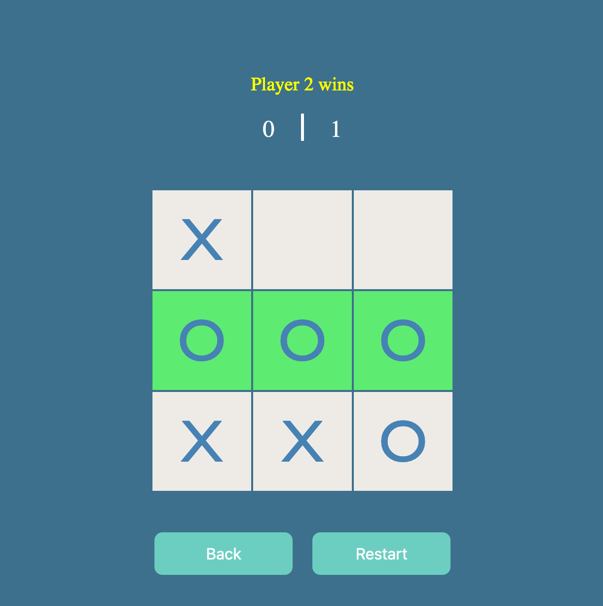

# web-tic-tac-toe

See it in action [here](https://bijaykumarpun.com.np/web-tic-tac-toe)!

A simple web implementation of Tic-Tac-Toe game created with `HTML`, `CSS` & `JavaScript`. There is no bot logic implementation essentially making it a 2P game.

> In case you ever want to run it locally, just `git clone` this project & open `index.html` file

### Screenshots

